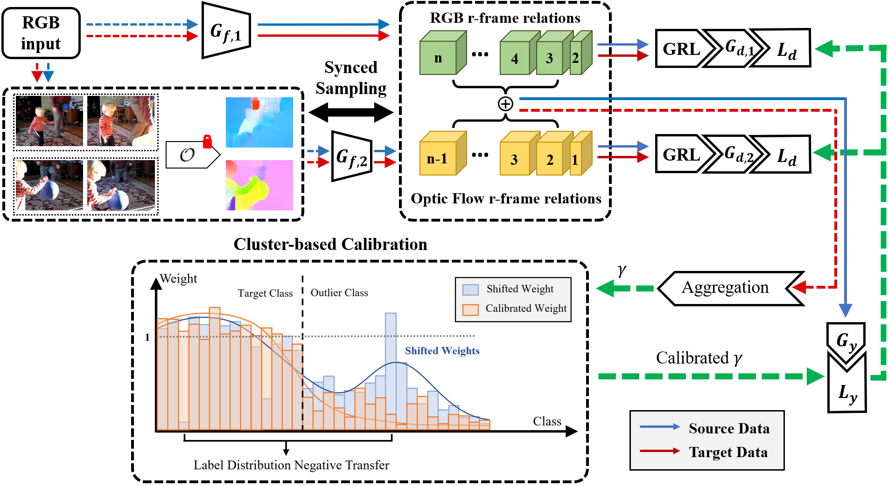

Calibrating Class Weights with Multi-Modal Information for Partial Video Domain Adaptation
---

Code demo for Calibrating Class Weights with Multi-Modal Information for Partial Video Domain Adaptation
Network Overview:

Requirements
---
* Python 3.7
* PyTorch 1.9
* spatial-correlation-sampler (local manual compile)

Usage
---
* Download datasets (HMDB51, UCF101, MK200, ARID).
* Put the videos under in a sub-folder under 'dataset' folder.
* Config the dataloader args manually.
* Obtain pretrained weights for TSN and GMA.
* Check training parameters and run the code.
* Use the evaluation.py for testing.

Hardware
---
* fp16 is enabled by default, please make sure your GPU support amp module of pytorch.
* bs=12 (a total of 24 videos are loaded for src and tgt) on a single card roughly comsumes 10Gig of VRAM with fp16 enabled.

